# Cybersecurity-home-lab
My cybersecurity home lab using Kali Linux, Windows Sever Active Directory, Splunk, and digital forensics tools.

# Cybersecurity Home Lab Setup Guide
## VMWare Workstation Pro Download

This repository documents the steps I followed to set up my cybersecurity home lab environment. It includes step-by-step instructions for downloading and installing tools such as VMware Workstation Pro.

## Purpose
The purpose of this project is to build a strong foundation in cybersecurity by creating a personal lab environment for hands-on practice.

## What This Includes
- Step-by-step guide to downloading VMware Workstation Pro
- Screenshots for each step
- Clear instructions for beginners

## Tools Covered
- VMware Workstation Pro
- (More tools will be added as I continue building my lab)

## Notes
This is part of my learning journey in cybersecurity, and I will continue updating this repository as I expand my home lab.

### Step 1
Go to Google and search for Broadcom page.

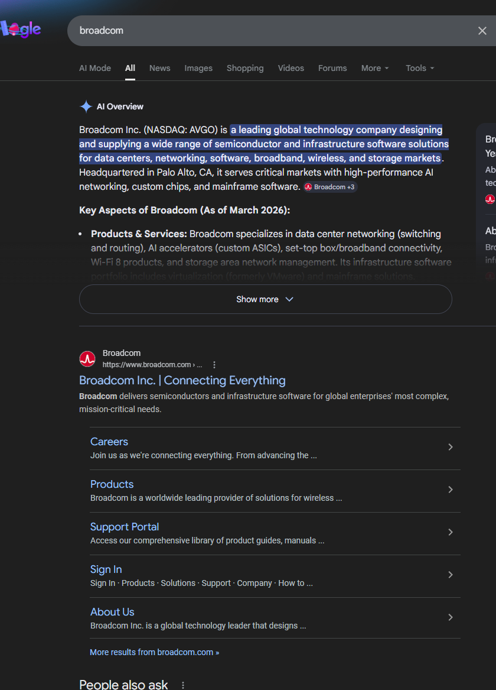

### Step 2
Once you are on the Broadcom page select **VMWare Products** from bottom left.

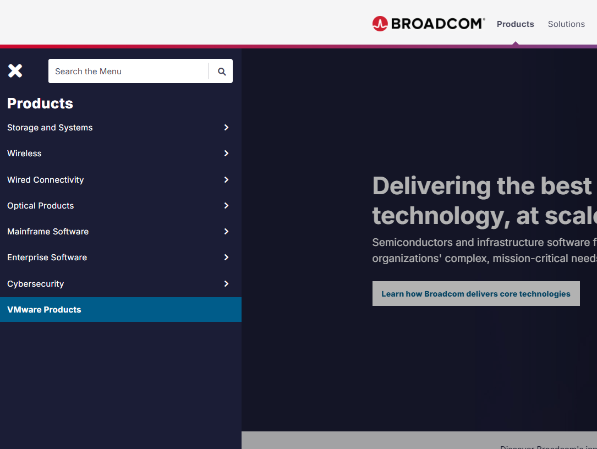

### Step 3
It will lead you to the login page. Make sure to select **Partner Portal**.

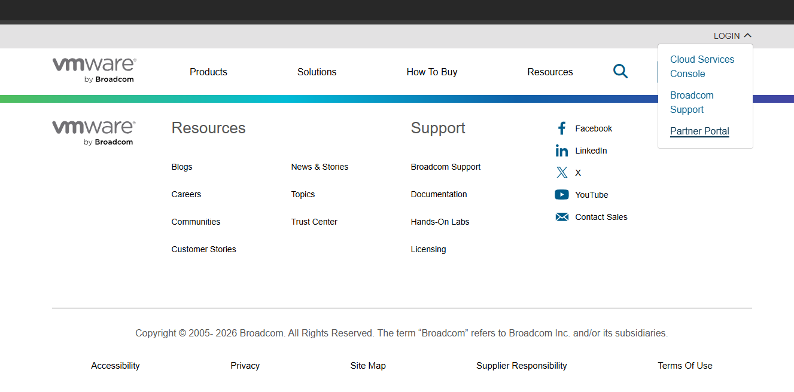

### Step 4
You will see two options: either login or register if you do not already have an account.

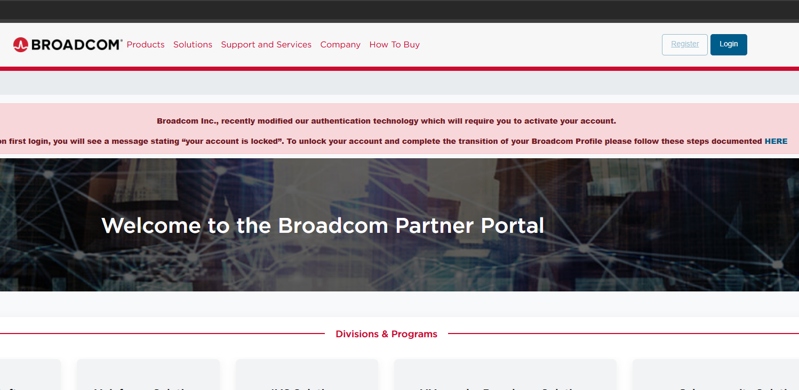

### Step 5
After registering with your email, you will be redirected to the main page.

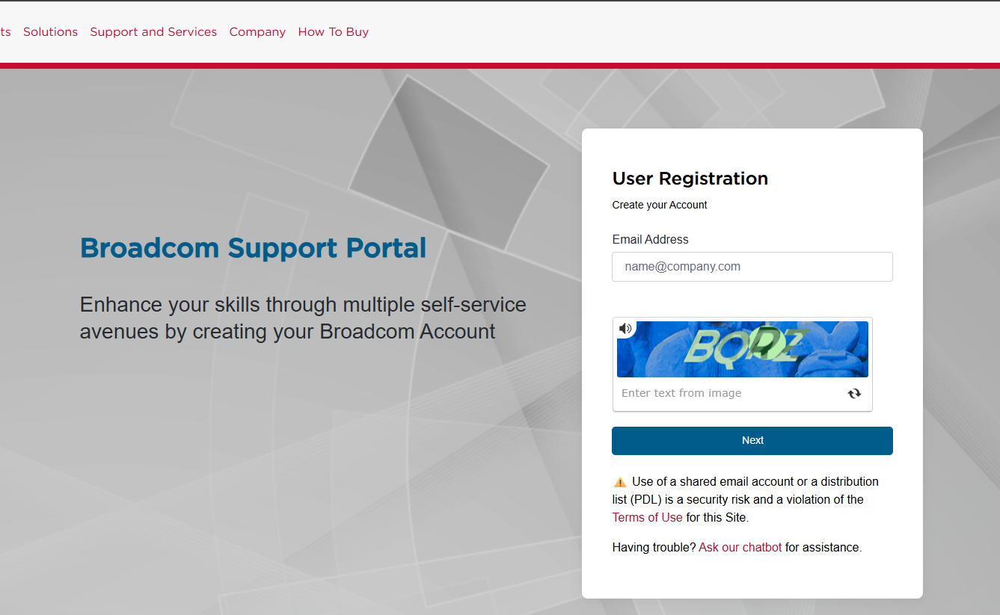

### Step 6
On the left side under **My Dashboard**, click **My Downloads**. You will see a notification that says **"Free Software Downloads Available HERE"** — click **HERE**.

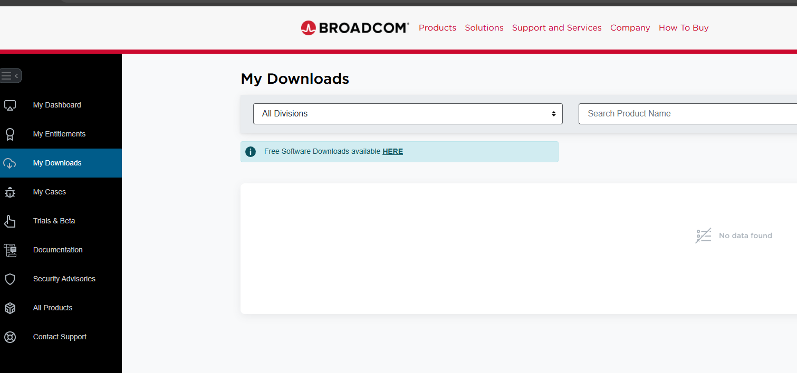

### Step 7
Once you are on the software page, click **VMware Workstation Pro** from the bottom right.

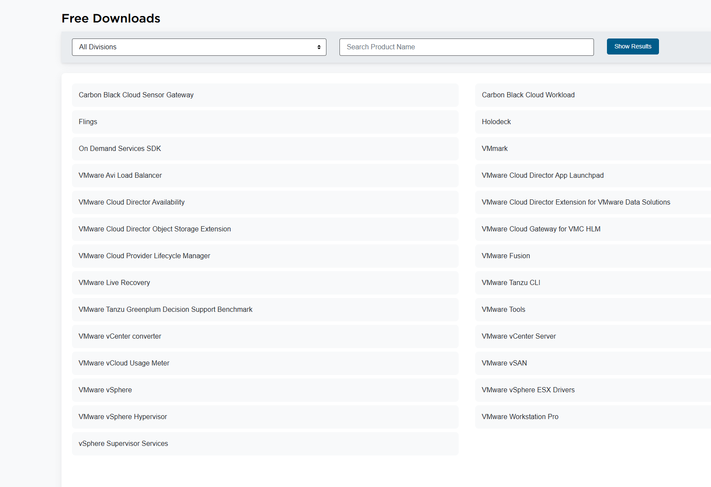

### Step 8
You will be given multiple versions to download. Choose the version that matches your operating system.

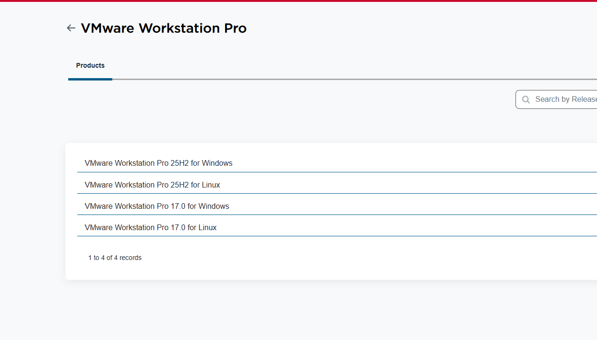

### Step 9
For example, I chose **VMware Workstation Pro 25H2 for Windows**, specifically version **25H2u1**.

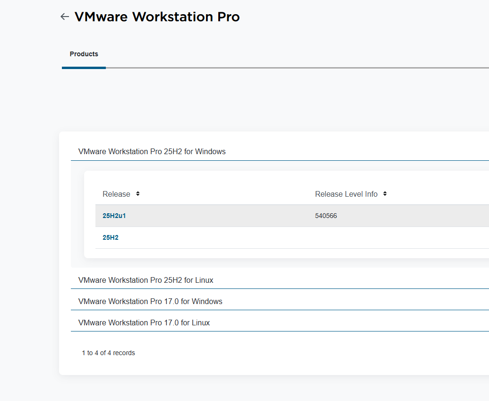

### Step 10
After clicking download, you will be taken to a page where you must agree to the terms and conditions. However, you will NOT be able to check the box right away. You need to click the small **“i” icon** first.

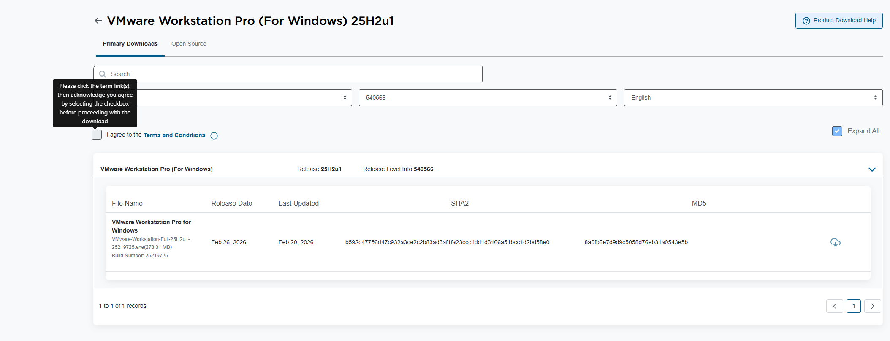

### Step 11
If you do not open the terms and conditions, the download button will continue to show the message **"Screening Required"**.

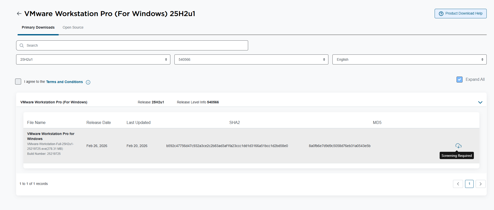

### Step 12
After clicking the terms and conditions, you will be redirected to **Broadcom Software Offerings – Agreements and Resources**. Select **End User Agreement (English)** or your preferred language from the left-hand side.

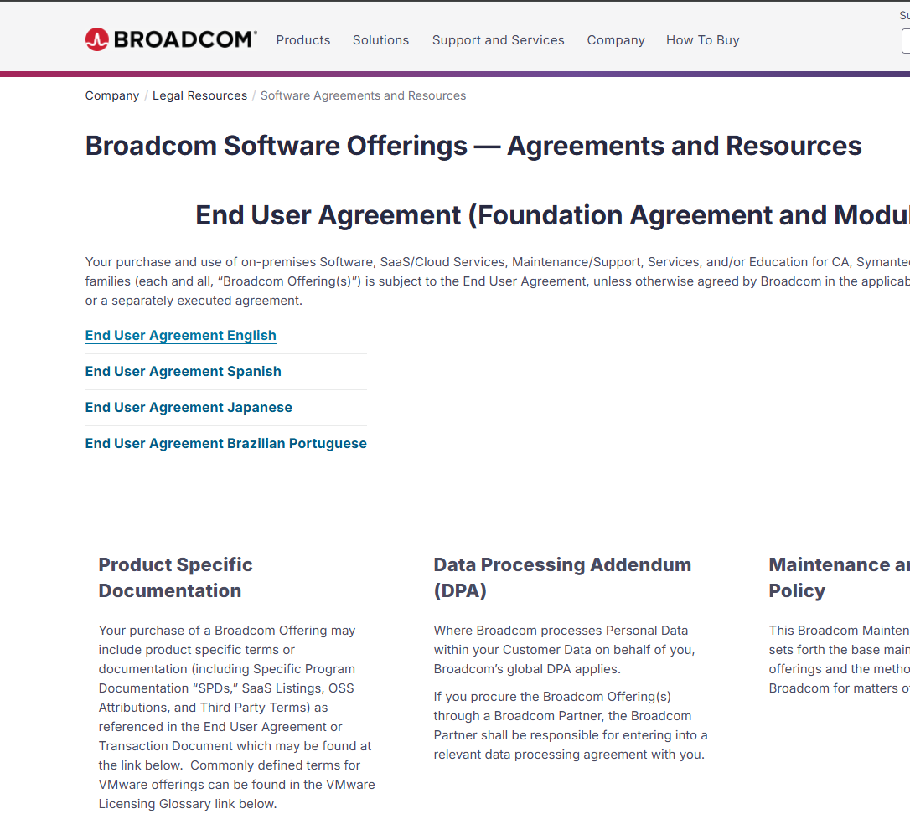

### Step 13
A PDF of the Broadcom agreement will open. After reviewing or closing it, go back to the previous page. You will now be able to check the box for **I agree to the Terms and Conditions**, then click download.

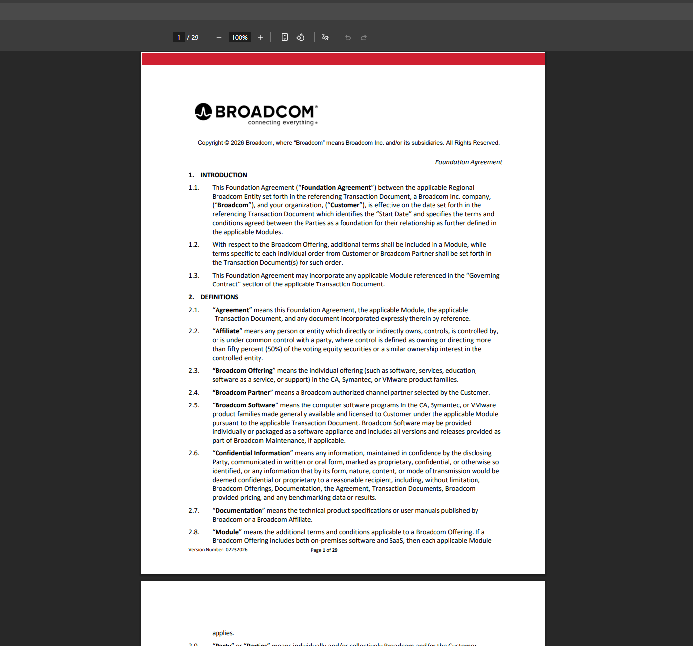

### Step 14
You may see a message saying: **"Prior to downloading this file, additional verification is required. Proceed?"** Click **Yes** and fill in your information, such as your full name and address.

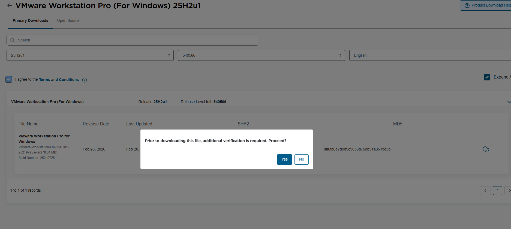

### Step 15
Once completed, you can finally download VMware Workstation Pro to your computer.

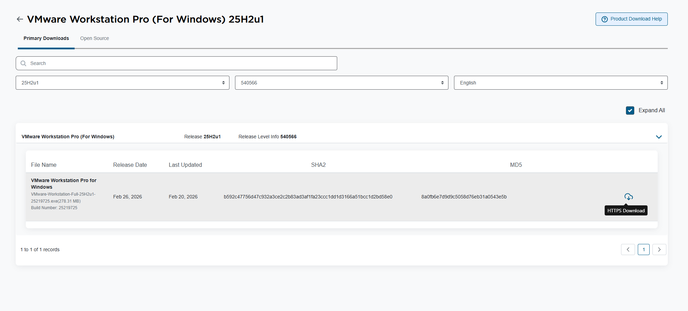

